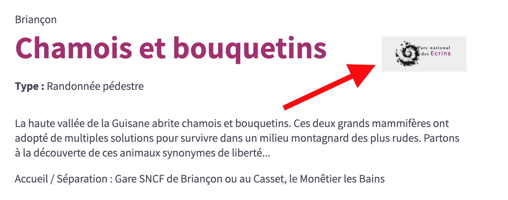

# Customization

You can override default settings, colors, CSS, HTML and translations in your own `customization` folder.

See the [general presentation](presentation-fr.md) for an overview of the application.

After each customization changes, you'll have to restart the Docker container by running `docker-compose restart`.

## Settings

Default configuration are defined in files from https://github.com/GeotrekCE/Geotrek-rando-v3/tree/main/frontend/config folder.
You can override all settings default values in files from your own `customization/config/` folder.

Examples of customizations are available in https://github.com/GeotrekCE/Geotrek-rando-v3/tree/main/frontend/customization/config folder.

In json files, you can just override the primary keys you need. You have to override primary keys globally.

- `global.json` (default value in https://github.com/GeotrekCE/Geotrek-rando-v3/blob/main/frontend/config/global.json) to define :

  - `searchResultsPageSize`, `mapResultsPageSize`: used to limit the sizes of results per page when fetching API
  - `maxPoiPerPage`: max number of point of interest (POI) displayed on a single trek page
  - `maxTouristicContentPerPage`: max number of touristic contents displayed on a single trek page
  - `portalIds`: eventual portal filters (list of ids). 

    - If no id has been set, Geotrek-rando retrieves all objets, whether or not they are associated with a portal in Geotrek-admin. 
    - If one or more ids have been set (example : [1,3]), Geotrek-rando only retrieves the objets of the configured portals. Therefore, if objects are not associated with any portal in Geotrek-admin, they will not be displayed in Geotrek-rando.
    
  - `enableSensitiveAreas`: boolean, default to false. Set it to true if sensitive areas are defined in your Geotrek-admin
  - `enableOutdoor`: boolean, default to false. Set it to true to enable Outdoor sites and courses
  - `groupTreksAndOutdoorFilters`: boolean, default to false. Groups treks and outdoor filters into a single tab. For this setting to work, `enableOutdoor` must be set to `true`.
  - `apiUrl` : Geotrek-admin API URL
  - `privacyPolicyLink`: link of the privacy policy (More information in [GDPR documentation](customization-scripts-GDPR.md#GDPR)).
  - `googleAnalyticsId`: eventual Google Analytics Id (to activate it, you must set `privacyPolicyLink`)
  - `googleSiteVerificationToken`: eventual code to enable Google Search Console and Google developer tools
  - `enableIndexation`: set this parameter to `false` to disable search engine indexing (default `true`)
  - `baseUrl`: base URL of your portal (for dynamic sitemap.xml)
  - `fallbackImageUri`: this uri is used to generate a default image for a trek or a touristic content if none is defined
  - `touristicContentLabelImageUri` : this uri is used to define the logo of the labeled touristic contents:
    
  - `applicationName`: application name appearing on PWA
  - `enableReport`: to enable report form in trek detail pages
  - `hCaptchaKey`: string key to enable Captcha validation in the report form. To create/define a key, see https://www.hcaptcha.com/
  - `enableSearchByMap`: to enable searching by map displayed area (bbox)
  - `maxLengthTrekAllowedFor3DRando`: Maximum length of meters allowed to enable 3D mode in the current trek. Adjust this setting carefully as too long a trek could freeze your browser. If this setting is defined to `0` (or `mapSatelliteLayers` from `map.json` is defined to `null`) the 3D mode feature is disabled for the whole application
  - `minAltitudeDifferenceToDisplayElevationProfile`: Minimum altitude difference in meters required to display the elevation profile in the current trek
  - `accessibilityCodeNumber`: emergency number. Default set to `114`.
  - `displayObjectsRelatedToItinerantTreks`: An object containing many booleans to display/hide objects related to itinerant treks. The keys are `POIs`,`touristicContents`,`sensitiveAreas`,`infrastructures`,`signages`,`service` and are all set to `true` by default. Indeed multi-days treks can be long and have a lot a related objects which is very long to display and not really readable. That's why you can disable some related objects that will not be displayed on itinerant main detail page, but will be displayed on steps detail pages and any other treks detail pages.

- `header.json` to define :

  - `logo` : Path to your logo image
  - `menu`: an object with 3 keys :

    - `supportedLanguages`: Array of available languages: `'CA','DE','FR','EN','ES',IT` are availables.
    - `defaultLanguage`: Your target audience's main language.
    - `primaryItemsNumber`: Number of items before dividing the main menu with a "See more" button. _Deprecated_ since 3.19.0: Use the MenuItems feature from Geotrek admin.

(see default values in https://github.com/GeotrekCE/Geotrek-rando-v3/blob/main/frontend/config/header.json)

- `home.json` to define homepage settings.

  - `activityBar`: This is a menu showing all search types (hiking practices, outdoor practices, tourist content categories and tourist events categories).

    - `shouldDisplay`: Boolean allowing this menu to be displayed or not. Its default value is `true`.
    - `numberOfItemsBeforeTruncation` The number of items displayed on the screen. To see the others, click on the "Show more" button. Its default value is `8`.
    - `links`: Allows you to customize the order and display of categories links. It's an array containing an object with 3 properties:
      ```typescript
      {
        "type" : 'trek' | 'outdoorSite' | 'touristicContent' | 'touristicEvent' ;
        "grouped" : boolean ; // If set to "true", all activities of the type are grouped under a single link.
        "iconUrl" : string ; // Optional, url to replace default icon. Used only if "grouped" is set to "true",
      }
      ```

    More explanations in this [comments](https://github.com/GeotrekCE/Geotrek-rando-v3/issues/560#issuecomment-1858166341) (in French).

  - `suggestions`: You can define blocks to display suggestions groups with treks ID, outdoor sites ID, services ID or events ID to highlight on homepage (see https://github.com/GeotrekCE/Geotrek-rando-v3/blob/main/frontend/customization/config/home.json).
    Each group has the following properties :

    ```typescript
    {
      "titleTranslationId": string: // you can use locales keys with the files inside `translations` folder
      "iconUrl": string; // url to the icon file
      "ids": string[]; // list of ids ,
      "type": 'trek' | 'service' | 'outdoor' | 'events'; // if not set, default to `trek`
    }
    ```

    Or you can define a suggestion block to display upcoming events, the structure is quite different:

    ```typescript
    {
      "titleTranslationId": string; // you can use locales keys with the files inside `translations` folder
      "iconUrl": string; // url to the icon file
      "numberOfItemsToDisplay": number; // Optional; If not defined all upcoming events will be displayed
      "type": 'upcomingEvents';
    }
    ```

  To define suggestions groups you need to build an `object` with the languages code as keys. By this way you can differentiate the valorization of a territory according to the selected language. If you don't need this feature (or if you want the same configuration for several language), use `default` key instead of a language code. The configuration in the example below displays 2 groups of suggestions for all languages except the English version with one different:

  ```json
  "suggestions": {
    "default": [
      {
        "titleTranslationId": "home.territoryTreks",
        "iconUrl": "/icons/practice-pedestrian.svg",
        "ids": ["2", "582", "586", "501", "771", "596"],
        "type": "trek"
      },
      {
        "titleTranslationId": "home.events",
        "iconUrl": "/icons/category-events.svg",
        "ids": ["1", "5"],
        "type": "events"
      },
    ],
    "en": [
      {
        "titleTranslationId": "home.treksDiscovery",
        "iconUrl": "/icons/pedestrian.svg",
        "ids": ["2", "582", "586"],
        "type": "trek"
      },
    ]
  }
  ```

  PS: For backward compatibility you can still use an array, this is the same behavior that `object` with only a `default` key. For example:

  ```json
  "suggestions": [
    {
      "titleTranslationId": "home.territoryTreks",
      "iconUrl": "/icons/practice-pedestrian.svg",
      "ids": ["2", "582", "586", "501", "771", "596"],
      "type": "trek"
    },
    {
      "titleTranslationId": "home.events",
      "iconUrl": "/icons/category-events.svg",
      "ids": ["1", "5"],
      "type": "events"
    },
  ]
  ```

  - In `welcomeBanner`, you can personnalize the cover on the homepage. You can add an asset on the top of the page: it can either be a video, a single picture or a carousel of images:

    - `videoUrl`: to add a video
    - `carouselUrls`: to add a carousel of images. You have to add an array of urls
    - `pictureUrl`: to add a single image

    Only one type of asset can be displayed. If you add several fields (`videoUrl` and `pictureUrl` for example), we will pick one, following this order of priority: video over carousel over picture.

    You can also enable a text to be displayed on the top of this asset:

    - `shouldDisplayText`: `true` to display the text on above the asset, `false` to hide it.

- `details.json` allows you to choose whether or not to display sections for each details pages ("trek", "touristicContent", "touristicEvent", "OutdoorSite" and "OutdoorCourse"). See the default configuration at https://github.com/GeotrekCE/Geotrek-rando-v3/blob/main/frontend/config/details.json.
  There are 4 properties :

      - `name`: the name of the section
      - `display`: boolean to display or not this section
      - `anchor`: boolean to display or not an anchor link in the menu navigation bar
      - `order`: number to define the position of this section

NB: For "report" and "reservationWidget" sections with `anchors` set to `true`, anchor links are not displayed like other elements, but by a dedicated icon.

- In the `footer.json` file, you can define social networks, informations about your organization, and some links (see example in https://github.com/GeotrekCE/Geotrek-rando-v3/blob/main/frontend/customization/config/footer.json).

  - Social networks: `facebook`, `twitter`, `youtube`, `instagram` or `fallback`.
  - Contact information such as your name, address, phone number and email.
  - Links based on the key pair `label`/`url` (can be based on translation labels for multilingual) and/or the key `informationID` whose value is equal to a flatpage identifier.

- `filter.json` to define filters to hide, their order and values (see example in https://github.com/GeotrekCE/Geotrek-rando-v3/blob/main/frontend/config/filter.json). If you want to :

  - Hide some of filters, you have to override their properties with `"display": false`.
  - Change the label for some filters, you need to define `translatedKey`, and copy the values into the translation files.
  - The `labels` filter contains an additional `withExclude` parameter. Its default value is `true`. By setting it to `true`, the user can filter the search by excluding a label (`withExclude` only works if your version of Geotrek Admin is equal to or higher than [2.77.0](https://github.com/GeotrekCE/Geotrek-admin/releases/tag/2.77.0); please set it to `false` if this is not the case)
  - The `organizer` event filter only works if your version of Geotrek Admin is equal to or higher than [2.100.0](https://github.com/GeotrekCE/Geotrek-admin/releases/tag/2.100.0)

- `map.json` to define basemaps URL and attributions, center (y, x), default and max zoom level (see example in https://github.com/GeotrekCE/Geotrek-rando-v3/blob/main/frontend/customization/config/map.json).

  - `searchMapCenter`: Array of two numbers `[latitude, longitude]` defining the map center point in the search view,
  - `searchMapZoom`: Default value is `10`. It defines the zoom level in the search view. **Warning**: It is important that the `searchMapZoom` value is included in the zoom value range of the basemap (`minZoom` and `maxZoom`), otherwise it may generate an error.
  - `maximumZoomLevel`: Default value is `17`. The default maximum zoom level if the maxZoom option is not defined in map layer (see below)
  - `displaySecondaryLayersByDefault`: Default value is `true`. Display or not display secondary layers (signages, infractructures and services) at page load on detail pages.

  You can also update the map layers. Three types of map layers are available: classic, satellite and offline. Each of them is structured as follows:

  ```ts
  interface LayerObject {
    url: string; // Url of the layer. It needs to be a valid tiles server url or a geoJSON file
    options: TileLayerOptions; // See https://leafletjs.com/reference.html#tilelayer-option
    bounds: string; // Url of a geoJSON polygon to display this layer inside.
  }
  ```

  The `url` prop should be a valid tiles server to use as base map.

  If its value ends in `.geojson` (or `.json`), its features are displayed on the map. The application looks at the `stroke-width`,`stroke-opacity`, `fill`, `fill-opacity` values of each `feature` `properties` to apply the colors. You can override these values by setting them in the `options` property (identical name but in camelCase format).

  If you define `name`, `photo_url`, `description` and/or `website` in the `properties` of a `feature`, it will be displayed in a tooltip when its feature is clicked in the map.

  - `mapClassicLayers`: array of `LayerObjects` for the default version.
  - `mapSatelliteLayers`: array of `LayerObjects` for the satellite version.
  - `mapOfflineLayer`: `LayerObject` registered for offline use. If it's explicitly set to `null`, the application uses the first layer of `mapClassicLayers` as a fallback.

  NB: If you want to have only one map available, you can add `mapSatelliteLayers: null`. This will remove the button that allows the user to switch between two map layers.

  - `zoomAvailableOffline` allows you to define the zoom modes allowed in offline mode. This allows you to control the amount of disk space required when caching. Default `[13,14,15]`

- `resultCard.json` to customize the elements to be displayed on featured cards that link to a details page (only trek cards for now).

  - You can display/hide the `location` and `themes` by defining a `display` key.
  - You can define an array of keywords in `informations` to display them (their order in the array matters). The keywords are as follows:
    - `'difficulty'`,
    - `'duration'`,
    - `'distance'`,
    - `'positiveElevation'`,
    - `'negativeElevation'`,
    - `'courseType'`,
    - `'networks'`,
      Default value is `"informations": ["difficulty", "duration", "distance", "positiveElevation"]`. See https://github.com/GeotrekCE/Geotrek-rando-v3/blob/main/frontend/config/resultCard.json.

- `redirects.json` to define URL rewriting for your instance. For example, you can use this customization to redirect old URL style (Geotrek-rando V2) to the new URL style (Geotrek-rando V3) or to redirect old URL to a new URL after changing the name of a hike in the backend.

  - In `rules`, you can define all the rules needed to redirect clients

    - `source`: must match to the old URL. Use the wildcard `*` to redirect a subdirectory. Use `:varname` to forward a variable to the destination
    - `destination`: must match to the new URL. Use `:varname` to inject a variable captured in the old URL
    - `permanent`: Set to `true` if the redirection is permanent. Set to `false` if the redirection is temporally. Default to `false`

    Examples :

    ```json
    {
      "rules": [
        {
          "source": "/a-cheval/col-de-font-froide",
          "destination": "/trek/582-col-de-font-froide"
        },
        {
          "source": "/a-pied/:name",
          "destination": "/search?rawText=:name"
        },
        {
          "source": "/fr/walking/:name",
          "destination": "/en/search?rawText=:name",
          "locale": false
        }
      ]
    }
    ```

    You can find more examples and more details following this link : https://nextjs.org/docs/api-reference/next.config.js/redirects

### _Warning:_

- When setting up Google Analytics, you have to setup a flow. When setting up the flow, be careful to enter the corresponding url (the url of your website), otherwise the data will not be received.
- By default Google analytics is disabled (`googleAnalyticsId` set to `null`), you will have to override it in the `global.json` file of your customization folder.

## Colors

You can override colors in `customization/theme/colors.json` file to change the main colors, based on https://github.com/GeotrekCE/Geotrek-rando-v3/blob/main/frontend/tailwind.config.js default theme.

Example for Cevennes national park orange colors:

```json
{
  "primary1": {
    "DEFAULT": "#ff9100",
    "light": "#ffa032"
  },
  "primary3": "#d57b04"
}
```

It's also possible to change category colors :

```json
{
  "categories": {
    "trek": "blue",
    "events": "red",
    "outdoor": "#62AB41",
    "service": "#3B89A2"
  }
}
```

NB: If global config `groupTreksAndOutdoorFilters` is set to `true`, the `outdoor` color is ignored in favor of the `trek` color.

## CSS

You can override CSS in `customization/theme/style.css` file. To help overriding CSS, some ID have been added on main DIV components:

- `home_content`, `home_activitiesBar`, `home_topHtml`, `home_section`, `home_activitySuggestion`, `banner_carousel`, etc on Homepage
- `header_logo` in Header
- Several similar ID on search and detail pages
- `home_container` to isolate Home page
- `search_container` to isolate Search page
- `details_container` to isolate detail pages
- `flatPage_container` to isolate static flatpages

In addition, some classes prefixed with `custo-*` are gradually being added to facilitate style overrides for components.
A dedicated [ticket](https://github.com/GeotrekCE/Geotrek-rando-v3/issues/1079) shows explanations and differents styling for the main menu (available since 3.19.0).

## Translations

You can override every texts in translations files, based on default ones (https://github.com/GeotrekCE/Geotrek-rando-v3/tree/main/frontend/src/translations).

You should at least override `home.title`, `home.description` and `home.welcome-text`.

## HTML / Scripts

### HTML templates :

You can include some HTML parts in different sections of the layout application.  
These templates can be translated by using the language code as a suffix (e.g. `homeTop-en.html` will be rendered only for the English interface). The application tries to find the localized template first, otherwise it tries the non-localized template, otherwise it displays nothing.  
NB: If you want to display a message common to all languages but not to a particular language (e.g. french), just create the template suffixed with its language code (e.g. `-fr.html`) and leave it empty, and voilà!

See examples in https://github.com/GeotrekCE/Geotrek-rando-v3/tree/main/frontend/customization/html.

#### Templates available on all pages

- `customization/html/headerTop.html`: before the header section
- `customization/html/headerBottom.html`: after the header section and before the content page
- `customization/html/footerTop.html`: before the footer section and after the content page
- `customization/html/footerBottom.html`: after the footer section

#### Templates available on home page

- `customization/html/homeTop.html`: first section of the homepage
- `customization/html/homeBottom.html`: last section of the homepage

#### Templates on details page (trek, touristic content, touristic event, outdoor site and outdoor course)

You can create your own templates to display practical information or widgets in different parts of the details page. There are 3 steps to follow:

1. Create a new file suffixed with `.html` in `customization/html/details/` (e.g. `example.html`) and fill the the content with html tags

   ```html
   <div>The id of this {{ type }} is {{ id }}</div>
   ```

You can define variables in "mustache templates" (meaning between brackets `{{ variable }}`) that will be converted once rendered. For the moment, there are 4 variables available:

- Page ID with `{{ id }}`
- Content type `{{ type }}`: rendered values are "trek", "touristicContent", "touristicEvent", "outdoorSite", "outdoorCourse").
- The code of the (departure) city `{{ cityCode }}`: useful for widgets such as forecast.
- The language code `{{ language }}` The current language of the page.

When choosing a template name, care must be taken not to select a reserved name used by sections defined by the application (e.g `presentation`, see https://github.com/GeotrekCE/Geotrek-rando-v3/blob/main/frontend/config/details.json).  
 If you do, the customized template will not be displayed.

2. Copy the template name without the `.html` suffix into the `customization/html/details.json` file.  
   For example I want to display it in treks and outdoor sites details page:
   ```json
   {
     "sections": {
       "trek": [
         {
           "name": "example",
           "display": true,
           "anchor": true,
           "order": 11
         }
       ],
       "outdoorSite": [
         {
           "name": "example",
           "display": true,
           "anchor": true,
           "order": 11
         }
       ]
     }
   }
   ```
3. Copy the section title/anchor into the translations files.  
    For example in `customization/translations/en.json`:
   ```json
   {
     "details": {
       "example": "My example"
     }
   }
   ```

You can take a look at `customization/html/details/forecastWidget.html` which shows the implementation.
By default the "forecast widget" is enabled for all content types; if you want to remove it, you need to write it explicitly in the `customization/html/details.json` file.

```json
{
  "sections": {
    "trek": [
      {
        "name": "forecastWidget",
        "display": false
      }
    ],
    "touristicContent": [
      {
        "name": "forecastWidget",
        "display": false
      }
    ],
    "touristicEvent": [
      {
        "name": "forecastWidget",
        "display": false
      }
    ],
    "outdoorSite": [
      {
        "name": "forecastWidget",
        "display": false
      }
    ],
    "outdoorCourse": [
      {
        "name": "forecastWidget",
        "display": false
      }
    ]
  }
}
```

### Scripts

You can also include some scripts:

- `customization/html/scriptsHeader.html`: in the `<head>` of the document
- `customization/html/scriptsFooter.html`: just before the `</body>` end tag

The scripts templates are intended for third party scripts. Unlike the HTML parts, there is not possibility of translations. More information on how to write them can be found in the [Scripts and GDPR documentation](customization-scripts-GDPR.md).

If you want to include an external JSON feed (for external latest news for example), you can check this [https://github.com/GeotrekCE/Geotrek-rando-v3/issues/1157](example documentation).

## Icons

Icons are provided by Geotrek-admin API. See [icons documentation](icons.md) to know how they have to be designed.

## Manifest.json

There is a default `manifest.json` generated using the `applicationName` parameters of `global.json` and icons/images detailed in the next section below (See: https://github.com/GeotrekCE/Geotrek-rando-v3/blob/main/frontend/src/pages/manifest.json.tsx#L20).
You can complete it by creating `manifest.json` file in the `customization/config/` folder and filling it with the props to add and/or override.

## About the cache

When new types of content are added (example: activities, type of places information, label, etc.), the related hiking pages then appear in error on the Geotrek-Rando website. This issue only exists in case of new content categories being added, not with every content update.
Simply restart the site to force the cache update or wait a few hours for the cache to reset.

It is also possible to completely disable Geotrek-Rando's cache but this may impact performance when loading pages. You'll find more details about disabling cache in this section [Caching](knowledge/caching.md)

## Images, favicon, mobile phone icons and splashscreens

These files need to be in the correct folder during the build process and therefore, we created a specific `medias` folder in the customization repository.

It provides 6 default images that can be customized:

- android-icon.png: It has to be 144x144px and controls the icon appearing on Android phones
- maskable-icon.png: It hass to be 144x144px and will be used only on android phones enabling round icons (it will hence be cropped to fit a circle by the android phones)
- apple-icon.png: It has to be 144x144px and controls the icon appearing on iOS phones
- android-splashscreen.png: It has to be 512x512px and controls the splashscreen appearing on Android phones
- ios-splashscreen.png: It has to be 512x512px and controls the splashscreen appearing on iOS phones
- favicon.png: It will be used as the favicon in web browsers

You can also add images and other files in the `medias` folder to be used as logo, images in HTML parts and static pages. They will be available on "url-geotrek-rando/medias/image-name.jpg" and can be linked as "/medias/image-name.jpg".

## Apply changes

After each customization changes, you'll have to restart the Docker container by running `docker-compose restart`.

## Production

To set environnement variables such as Sentry configuration, build and run the application see the [Installation documentation](installation.md).
