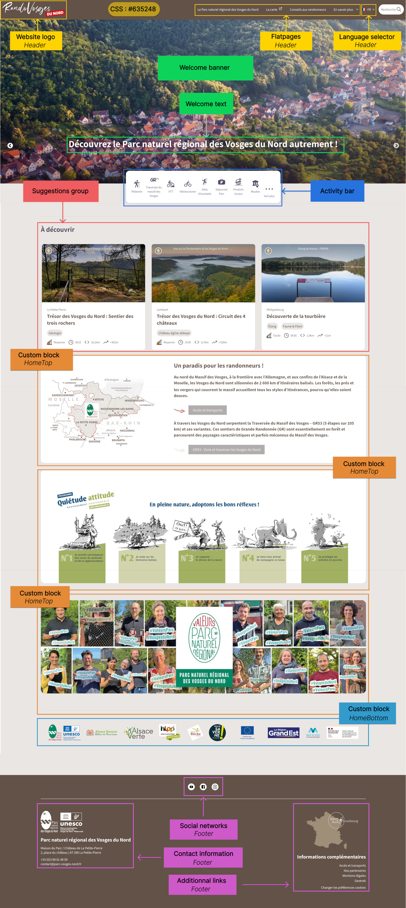

# Homepage

Here is a list of elements that can be customized on the homepage:

**Header**

- site name
- logo
- primary colors
- menus and static page hierarchy ([configurable in Geotrek-admin](https://geotrek.readthedocs.io/en/latest/user-manual/static-pages.html#pages-statiques-menus))
- language selector

**Welcome banner**

- images displayed in a rotating carousel or a single image or a video
- welcome text

**Activity Bar**

- activity bar is enabled by default

**Suggestions group**

- suggestions groups with treks ID, outdoor sites ID, services ID or events ID

**Hometop** (optional)

- custom blocks (interactive map, image/text banners, etc.)

**Homebottom** (optional)

- custom blocks (image/text banners, partner logos, promotion of the mobile app, promotion of the Suricate app for issue reporting)

**Footer**

- social media links (Facebook, LinkedIn, YouTube, etc.)
- organization contact information (name, postal address, email, phone number)
- additional information (external links, links to static pages)

