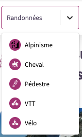
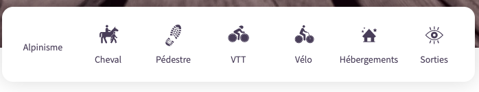
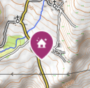
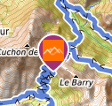

# Icons

Geotrek-rando V3 uses icons which images come from API. This file intends to help upload a right format for them in Geotrek-admin.

## Activity icons

Activity icons are used in many places. Their color can be modified depending the context.
Because of that, they have to be :

- in **`svg` format**
- **white**, or with a light color, by default (a color that is visible on a `primary1` background)
- **without filled background** : only shapes or lines
- without `width` and `height` attributes
- preferrably, **no different colors**. If different colors are used, they will be lost anyway when the icon is modified. The icon has to stay readable with all its shapes and lines in one color.
- with an usable licence and credits

**Default activity icons**, not modified, are visible in search filter list or on map 

Here the "Alpinisme" icon should have been white by default.

**Modified activity icons** are visible on activity bar on home or details page:

- They are in grey instead of white.
- If the initial icon has several colors, they will be lost here.
- If the initial icon is in `png` or `jpg`, they won't appear, as the "Alpinisime" icon above.

## Touristic content and Point of interest icons

They are used on map marker and on card.

`svg`, `png` and `jpg` format are accepted, with any colors. **However, because of the map, it's recommended to use `png` or `svg`, with transparent background,** and with **white** filling.

Another light color can be used, but the icon has to be visible on a background set to `primary1` color.

**_Good icon example :_**

**_Bad icon example :_** jpg with no transparent background, "orange square" visible:

