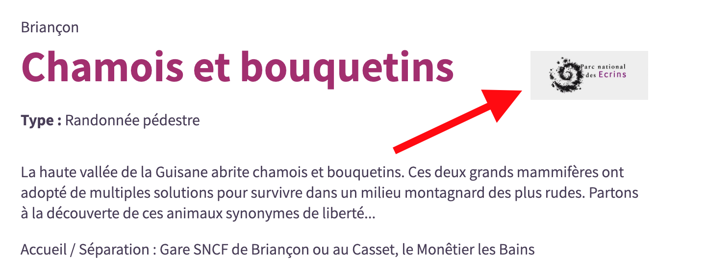

# Customization of settings

Default configuration are defined in files from [config folder](https://github.com/GeotrekCE/Geotrek-rando-v3/tree/main/frontend/config).
You can override all settings default values in files from your own `customization/config/` folder.

Examples of customizations are available in [Geotrek-rando v3 config folder](https://github.com/GeotrekCE/Geotrek-rando-v3/tree/main/frontend/customization/config).

In json files, you can just override the primary keys you need. You have to override primary keys globally.

## `global.json`

- `global.json` (default value in [global.json file](https://github.com/GeotrekCE/Geotrek-rando-v3/blob/main/frontend/config/global.json)) to define :

    - `searchResultsPageSize`, `mapResultsPageSize`: used to limit the sizes of results per page when fetching API
    - `maxPoiPerPage`: max number of point of interest (POI) displayed on a single trek page
    - `maxTouristicContentPerPage`: max number of touristic contents displayed on a single trek page
    - `portalIds`: eventual portal filters (list of ids).

        - If no id has been set, Geotrek-rando retrieves all objets, whether or not they are associated with a portal in Geotrek-admin.
        - If one or more ids have been set (example : [1,3]), Geotrek-rando only retrieves the objets of the configured portals. Therefore, if objects are not associated with any portal in Geotrek-admin, they will not be displayed in Geotrek-rando.

    - `enableSensitiveAreas`: boolean, default to false. Set it to true if sensitive areas are defined in your Geotrek-admin
    - `enableOutdoor`: boolean, default to false. Set it to true to enable Outdoor sites and courses
    - `groupTreksAndOutdoorFilters`: boolean, default to false. Groups treks and outdoor filters into a single tab. For this setting to work, `enableOutdoor` must be set to `true`.
    - `apiUrl` : Geotrek-admin API URL
    - `privacyPolicyLink`: link of the privacy policy (More information in [GDPR section](./customization-gdpr.md)).
    - `googleAnalyticsId`: eventual Google Analytics Id (to activate it, you must set `privacyPolicyLink`)
    - `googleSiteVerificationToken`: eventual code to enable Google Search Console and Google developer tools
    - `enableIndexation`: set this parameter to `false` to disable search engine indexing (default `true`)
    - `baseUrl`: base URL of your portal (for dynamic sitemap.xml)
    - `fallbackImageUri`: this uri is used to generate a default image for a trek or a touristic content if none is defined
    - `touristicContentLabelImageUri` : this uri is used to define the logo of the labeled touristic contents:
    
    - `applicationName`: application name appearing on PWA
    - `enableReport`: to enable report form in trek detail pages
    - `hCaptchaKey`: string key to enable Captcha validation in the report form. To create/define a key, see [www.hcaptcha.com/](https://www.hcaptcha.com/).    
    - `enableSearchByMap`: to enable searching by map displayed area (bbox)
    - `maxLengthTrekAllowedFor3DRando`: Maximum length of meters allowed to enable 3D mode in the current trek. Adjust this setting carefully as too long a trek could freeze your browser. If this setting is defined to `0` (or `mapSatelliteLayers` from `map.json` is defined to `null`) the 3D mode feature is disabled for the whole application
    - `minAltitudeDifferenceToDisplayElevationProfile`: Minimum altitude difference in meters required to display the elevation profile in the current trek
    - `accessibilityCodeNumber`: emergency number. Default set to `114`.
    - `displayObjectsRelatedToItinerantTreks`: An object containing many booleans to display/hide objects related to itinerant treks. The keys are `POIs`,`touristicContents`,`sensitiveAreas`,`infrastructures`,`signages`,`service` and are all set to `true` by default. Indeed multi-days treks can be long and have a lot a related objects which is very long to display and not really readable. That's why you can disable some related objects that will not be displayed on itinerant main detail page, but will be displayed on steps detail pages and any other treks detail pages.

## `header.json`

- `header.json` (default value in [header.json file](https://github.com/GeotrekCE/Geotrek-rando-v3/blob/main/frontend/config/header.json)) to define :

    - `logo` : Path to your logo image
    - `menu`: an object with 3 keys :

      - `supportedLanguages`: Array of available languages: `'CA','DE','FR','EN','ES',IT` are availables.
      - `defaultLanguage`: Your target audience's main language.
      - `primaryItemsNumber`: Number of items before dividing the main menu with a "See more" button. _Deprecated_ since 3.19.0: Use the MenuItems feature from Geotrek admin.

## `home.json`

- `home.json` (default value in [home.json file](https://github.com/GeotrekCE/Geotrek-rando-v3/blob/main/frontend/config/home.json)) to define homepage settings :

    - `activityBar`: This is a menu showing all search types (hiking practices, outdoor practices, tourist content categories and tourist events categories).

      - `shouldDisplay`: Boolean allowing this menu to be displayed or not. Its default value is `true`.
      - `numberOfItemsBeforeTruncation` The number of items displayed on the screen. To see the others, click on the "Show more" button. Its default value is `8`.
      - `links`: Allows you to customize the order and display of categories links. It's an array containing an object with 3 properties :

      ```typescript
      {
        "type" : 'trek' | 'outdoorSite' | 'touristicContent' | 'touristicEvent' ;
        "grouped" : boolean ; // If set to "true", all activities of the type are grouped under a single link.
        "iconUrl" : string ; // Optional, url to replace default icon. Used only if "grouped" is set to "true",
      }
      ```
!!! note

    **Activity bar customization**

    - **Default Configuration**: The `activityBar` is enabled by default with four types of content (`trek`, `outdoorSite`, `touristicContent`, `touristicEvent`). Example configuration:
    ```json
      "activityBar": {
      "shouldDisplay": true,
      "numberOfItemsBeforeTruncation": 8,
      "links": [
        { "type": "trek", "grouped": false },
        { "type": "outdoorSite", "grouped": false }
      ]
      }
    ```
    - **Reordering or Hiding Categories**: Adjust the order or hide certain categories by modifying the `links` array. For example, to display only `touristicContent` and `outdoorSite`:
    ```json
      "links": [
        { "type": "touristicContent", "grouped": false },
        { "type": "outdoorSite", "grouped": false }
      ]
    ```
    - **Group Categories**: To group content types under a single button, set `grouped` to `true`:
    ```json
      "links": [
        { "type": "trek", "grouped": true },
        { "type": "touristicEvent", "grouped": true }
      ]
    ```

  - `suggestions`: You can define blocks to display suggestions groups with treks ID, outdoor sites ID, services ID or events ID to highlight on [homepage](https://github.com/GeotrekCE/Geotrek-rando-v3/blob/main/frontend/customization/config/home.json).
    Each group has the following properties :

    ```typescript
    {
      "titleTranslationId": string: // you can use locales keys with the files inside `translations` folder
      "iconUrl": string; // url to the icon file
      "ids": string[]; // list of ids ,
      "type": 'trek' | 'service' | 'outdoor' | 'events'; // if not set, default to `trek`
    }
    ```

    Or you can define a suggestion block to display upcoming events, the structure is quite different:

    ```typescript
    {
      "titleTranslationId": string; // you can use locales keys with the files inside `translations` folder
      "iconUrl": string; // url to the icon file
      "numberOfItemsToDisplay": number; // Optional; If not defined all upcoming events will be displayed
      "type": 'upcomingEvents';
    }
    ```

  To define suggestions groups you need to build an `object` with the languages code as keys. By this way you can differentiate the valorization of a territory according to the selected language. If you don't need this feature (or if you want the same configuration for several language), use `default` key instead of a language code. The configuration in the example below displays 2 groups of suggestions for all languages except the English version with one different:

  ```json
  "suggestions": {
    "default": [
      {
        "titleTranslationId": "home.territoryTreks",
        "iconUrl": "/icons/practice-pedestrian.svg",
        "ids": ["2", "582", "586", "501", "771", "596"],
        "type": "trek"
      },
      {
        "titleTranslationId": "home.events",
        "iconUrl": "/icons/category-events.svg",
        "ids": ["1", "5"],
        "type": "events"
      },
    ],
    "en": [
      {
        "titleTranslationId": "home.treksDiscovery",
        "iconUrl": "/icons/pedestrian.svg",
        "ids": ["2", "582", "586"],
        "type": "trek"
      },
    ]
  }
  ```

  PS: For backward compatibility you can still use an array, this is the same behavior that `object` with only a `default` key. For example:

  ```json
  "suggestions": [
    {
      "titleTranslationId": "home.territoryTreks",
      "iconUrl": "/icons/practice-pedestrian.svg",
      "ids": ["2", "582", "586", "501", "771", "596"],
      "type": "trek"
    },
    {
      "titleTranslationId": "home.events",
      "iconUrl": "/icons/category-events.svg",
      "ids": ["1", "5"],
      "type": "events"
    },
  ]
  ```

  - In `welcomeBanner`, you can personnalize the cover on the homepage. You can add an asset on the top of the page: it can either be a video, a single picture or a carousel of images:

    - `videoUrl`: to add a video
    - `carouselUrls`: to add a carousel of images. You have to add an array of urls
    - `pictureUrl`: to add a single image

    Only one type of asset can be displayed. If you add several fields (`videoUrl` and `pictureUrl` for example), we will pick one, following this order of priority: video over carousel over picture.

    You can also enable a text to be displayed on the top of this asset:

    - `shouldDisplayText`: `true` to display the text on above the asset, `false` to hide it.

## `details.json`

- `details.json` allows you to choose whether or not to display sections for each details pages ("trek", "touristicContent", "touristicEvent", "OutdoorSite" and "OutdoorCourse"). See the [default configuration](https://github.com/GeotrekCE/Geotrek-rando-v3/blob/main/frontend/config/details.json) .
  There are 4 properties :

      - `name`: the name of the section
      - `display`: boolean to display or not this section
      - `anchor`: boolean to display or not an anchor link in the menu navigation bar
      - `order`: number to define the position of this section

NB: For "report" and "reservationWidget" sections with `anchors` set to `true`, anchor links are not displayed like other elements, but by a dedicated icon.

## `footer.json`

- In the `footer.json` file, you can define social networks, informations about your organization, and some links (see [example](https://github.com/GeotrekCE/Geotrek-rando-v3/blob/main/frontend/customization/config/footer.json)).

  - Social networks: `facebook`, `twitter`, `youtube`, `instagram` or `fallback`.
  - Contact information such as your name, address, phone number and email.
  - Links based on the key pair `label`/`url` (can be based on translation labels for multilingual) and/or the key `informationID` whose value is equal to a flatpage identifier.

## `filter.json`

- `filter.json` to define filters to hide, their order and values (see [example](https://github.com/GeotrekCE/Geotrek-rando-v3/blob/main/frontend/config/filter.json). If you want to :

  - Hide some of filters, you have to override their properties with `"display": false`.
  - Change the label for some filters, you need to define `translatedKey`, and copy the values into the translation files.
  - The `labels` filter contains an additional `withExclude` parameter. Its default value is `true`. By setting it to `true`, the user can filter the search by excluding a label (`withExclude` only works if your version of Geotrek Admin is equal to or higher than [2.77.0](https://github.com/GeotrekCE/Geotrek-admin/releases/tag/2.77.0); please set it to `false` if this is not the case)
  - The trek `networks` filter only works if yout version of Geotrek Admin is equal to or higher than [2.108.0](https://github.com/GeotrekCE/Geotrek-admin/releases/tag/2.108.0)
  - The event `organizer` filter only works if your version of Geotrek Admin is equal to or higher than [2.100.0](https://github.com/GeotrekCE/Geotrek-admin/releases/tag/2.100.0)

## `map.json`

- `map.json` to define basemaps URL and attributions, center (y, x), default and max zoom level (see [example](https://github.com/GeotrekCE/Geotrek-rando-v3/blob/main/frontend/customization/config/map.json)).

  - `searchMapCenter`: Array of two numbers `[latitude, longitude]` defining the map center point in the search view,
  - `searchMapZoom`: Default value is `10`. It defines the zoom level in the search view. **Warning**: It is important that the `searchMapZoom` value is included in the zoom value range of the basemap (`minZoom` and `maxZoom`), otherwise it may generate an error.
  - `maximumZoomLevel`: Default value is `17`. The default maximum zoom level if the maxZoom option is not defined in map layer (see below)
  - `displaySecondaryLayersByDefault`: Default value is `true`. Display or not display secondary layers (signages, infractructures and services) at page load on detail pages.

  You can also update the map layers. Three types of map layers are available: classic, satellite and offline. Each of them is structured as follows:

  ```ts
  interface LayerObject {
    url: string; // Url of the layer. It needs to be a valid tiles server url or a geoJSON file
    options: TileLayerOptions; // See https://leafletjs.com/reference.html#tilelayer-option
    bounds: string; // Url of a geoJSON polygon to display this layer inside.
  }
  ```

  The `url` prop should be a valid tiles server to use as base map.

  If its value ends in `.geojson` (or `.json`), its features are displayed on the map. The application looks at the `stroke-width`,`stroke-opacity`, `fill`, `fill-opacity` values of each `feature` `properties` to apply the colors. You can override these values by setting them in the `options` property (identical name but in camelCase format).

  If you define `name`, `photo_url`, `description` and/or `website` in the `properties` of a `feature`, it will be displayed in a tooltip when its feature is clicked in the map.

  - `mapClassicLayers`: array of `LayerObjects` for the default version.
  - `mapSatelliteLayers`: array of `LayerObjects` for the satellite version.
  - `mapOfflineLayer`: `LayerObject` registered for offline use. If it's explicitly set to `null`, the application uses the first layer of `mapClassicLayers` as a fallback.

  NB: If you want to have only one map available, you can add `mapSatelliteLayers: null`. This will remove the button that allows the user to switch between two map layers.

  - `zoomAvailableOffline` allows you to define the zoom modes allowed in offline mode. This allows you to control the amount of disk space required when caching. Default `[13,14,15]`

## `resultCard.json`

- `resultCard.json` to customize the elements to be displayed on featured cards that link to a details page (only trek cards for now).

  - You can display/hide the `location` and `themes` by defining a `display` key.
  - You can define an array of keywords in `informations` to display them (their order in the array matters). The keywords are as follows:
    - `'difficulty'`,
    - `'duration'`,
    - `'distance'`,
    - `'positiveElevation'`,
    - `'negativeElevation'`,
    - `'courseType'`,
    - `'networks'`,

Default value is 
`
"informations": ["difficulty", "duration", "distance", "positiveElevation"]
`. See [example](https://github.com/GeotrekCE/Geotrek-rando-v3/blob/main/frontend/config/resultCard.json).

## `redirects.json`

- `redirects.json` to define URL rewriting for your instance. For example, you can use this customization to redirect old URL style (Geotrek-rando V2) to the new URL style (Geotrek-rando V3) or to redirect old URL to a new URL after changing the name of a hike in the backend.

  - In `rules`, you can define all the rules needed to redirect clients

    - `source`: must match to the old URL. Use the wildcard `*` to redirect a subdirectory. Use `:varname` to forward a variable to the destination
    - `destination`: must match to the new URL. Use `:varname` to inject a variable captured in the old URL
    - `permanent`: Set to `true` if the redirection is permanent. Set to `false` if the redirection is temporally. Default to `false`

    Examples :

    ```json
    {
      "rules": [
        {
          "source": "/a-cheval/col-de-font-froide",
          "destination": "/trek/582-col-de-font-froide"
        },
        {
          "source": "/a-pied/:name",
          "destination": "/search?rawText=:name"
        },
        {
          "source": "/fr/walking/:name",
          "destination": "/en/search?rawText=:name",
          "locale": false
        }
      ]
    }
    ```
    
You can find more examples and more details following [this link](https://nextjs.org/docs/api-reference/next.config.js/redirects).
