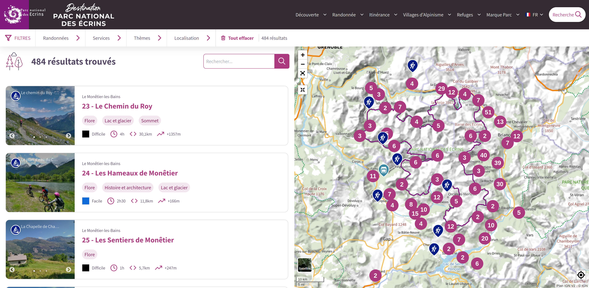

# Geotrek-rando v3

Geotrek-rando is the public web application displaying the interface you can use to value your territory treks and tourism products! 
Demo available at [https://gtr3demo.ecrins-parcnational.fr](https://gtr3demo.ecrins-parcnational.fr).

The third version is a full redesign and rewriting of Geotrek-rando with React, and NextJS for Server side rendering (SSR) and SEO.

Geotrek-rando v3 is directly connected to Geotrek-admin v2 API.

## 💡 Présentation

Read more in the [general presentation](./presentation-fr.md).

## 🚀 Installation

- [Installation in production](./installation.md)

## 🎨 Customization

- [Customization](./customization.md)
- [Scripts and GDPR](./customization.md)
- [Customize icons](./icons.md)

## 🔧 Development

- [Installation in development](./development.md)
- [Deployment](./deployment.md)

## ✨ Knowledge 

- [Caching strategies](./knowledge/caching.md)
- [Debug mode](./knowledge/debug.md)
- [Pages and navigation](./knowledge/pages-and-navigation.md)
- [Server side rendering](./knowledge/server-side-rendering.md)

## 🧱 Architecture decision record 

- [Main framework](./adrs/main_framework.md)
- [Deployment solution](./adrs/deployment_solution.md)

## 🪄 Getting started

- Follow the [development](./development.md) docs
- Head to [localhost:3000](http://localhost:3000)

