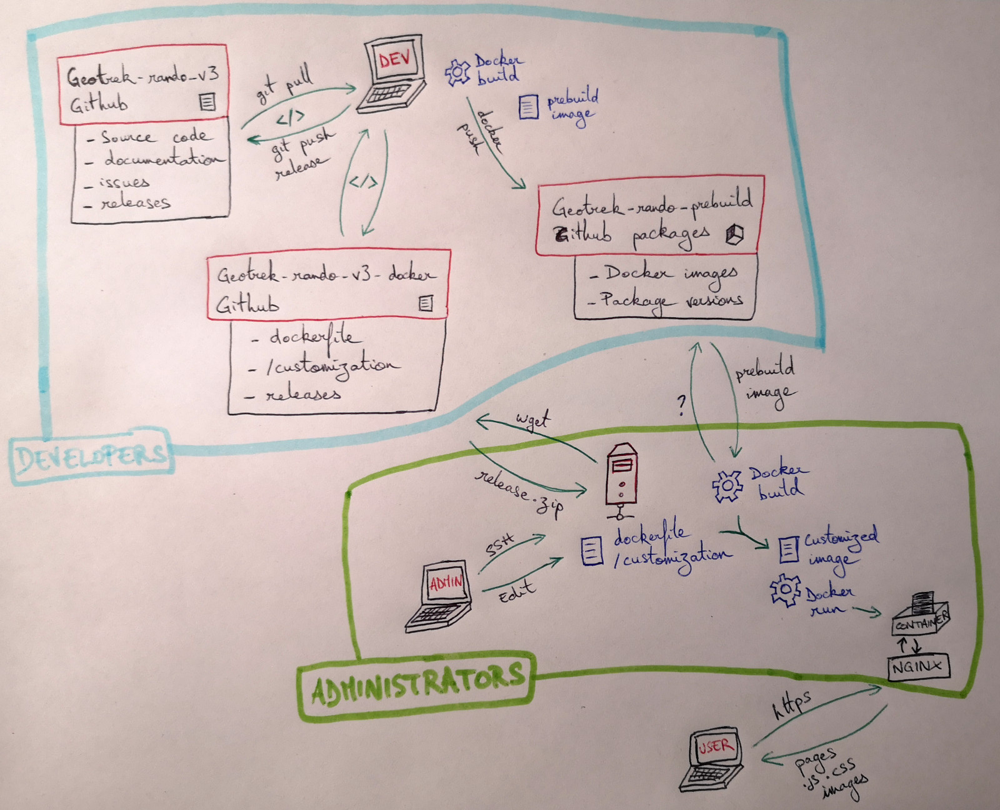
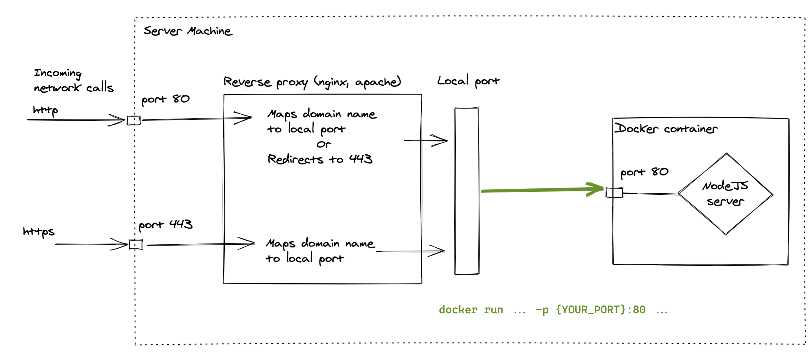

# Installation

Install Geotrek-rando on your own computer or server.

# Install with Docker (recommended)

## Global process



Before starting the technical installation, here is an overview of the global process:
- Developers are working on code source of this repository where you will also find the documentation, issues and releases
- Once they have a new version of the application ready, they will release it, build a prebuild image of this new version and push it in the [packages repository](https://github.com/orgs/GeotrekCE/packages/container/package/geotrek-rando-v3%2Fgeotrek-rando-prebuild)
- If required, they will also make changes to the dockerfile and customization template in the [dedicated repository](https://github.com/GeotrekCE/Geotrek-rando-v3-docker) and release a new version of it
- Administrators will log in on their host with SSH and install Docker on it
- They will download an archive of the latest version of the Docker customization repository and extract it on their host
- They will edit the customization files and build a customized image of the application
- They will run this customized image in a Docker container that will be available with a web browser through NGINX

## Install Docker

You need to have Docker installed on your own computer or server. Docker allows to easily install and update Geotrek-rando on several plateforms (Linux, Windows, macOS).

- Docker installation documentation is [right here](https://docs.docker.com/engine/install/).
- You will also need to follow the [post install process](https://docs.docker.com/engine/install/linux-postinstall/) as well to be able to download the Geotrek-rando container with your non-root Linux user.

## Install Geotrek-rando

You will have to download the prebuilt default Docker image of Geotrek-rando and its customization folder template and build a customized image on your own computer or server.

- Create a folder to install your Geotrek-rando (`/home/myuser/geotrekrando` for instance) and go in this folder
- On your server download the [Geotrek-rando-docker repository](https://github.com/GeotrekCE/Geotrek-rando-v3-docker) version you want: `wget https://github.com/GeotrekCE/Geotrek-rando-v3-docker/archive/vX.Y.Z.zip` (replace `X.Y.Z` with the version of Geotrek-rando-v3-docker that is compatible with the Geotrek-rando-v3 version you want to use) and unzip it. You can also git clone it (`git pull https://github.com/GeotrekCE/Geotrek-rando-v3-docker.git`)
- Update the files in the `/customization` folder according to your structure (See [customization](customization.md) documentation)
- Go in the root folder of your Geotrek-rando-v3 docker and build a [specific version](https://github.com/orgs/GeotrekCE/packages/container/package/geotrek-rando-v3%2Fgeotrek-rando-prebuild) of the Docker image with `docker build -t geotrek-rando --build-arg VERSION={THE VERSION YOU WANT} .`
- Now we want to run the website that we just built and make it available from your server adress. To do so run the docker image on the port you want: `docker run --restart unless-stopped -d -p {YOUR_PORT}:80 geotrek-rando`
  - Let's explain what this command does step by step
    - `docker run [options] geotrek-rando` runs the container named geotrek-rando that we've just built
    - the `-d` option specifies that it should run "deamonized" meaning the container should run in background instead of keeping the terminal window linked to its stdout.
    - the `-p` option specifies a port mapping between the port you want to connect on your machine to the port the server is running on in the docker container (here 80). Replace `{YOUR_PORT}` by any available port on your host.
    
    - the `--restart unless-stopped` option specified that unless you stopped the container on purpose, it should restart automatically if something goes wrong.
- Your website is now available to the address of your server

You can then serve what comes out of your local `{YOUR PORT}` port. To configure NGINX, see below.

## An example with NGINX

- Create a new site configuration in your `sites-available` folder (in `/etc/nginx`), `geotrekrando.conf` in this example
- Here is its minimal configuration:

```bash
server {
   location / {
        proxy_pass http://localhost:{YOUR PORT};
        proxy_http_version 1.1;
        proxy_set_header Upgrade $http_upgrade;
        proxy_set_header Connection 'upgrade';
        proxy_set_header Host $host;
        proxy_cache_bypass $http_upgrade;
        proxy_set_header        X-Real-IP       $remote_addr;
        proxy_set_header        X-Forwarded-For $proxy_add_x_forwarded_for;
   }
    listen 80;
    listen [::]:80;
    server_name {mydomain.fr};
}
```

Update `{YOUR PORT}` and `{mydomain.fr}` depending on your context.

Make sure to enable it by creating a symbolic link from `sites-enabled` to it with:

```bash
ln -s /etc/nginx/sites-available/geotrekrando.conf /etc/nginx/sites-enabled/
sudo service nginx reload
```

Feel free to add https configuration at will.

Example with Certbot:

```bash
## Install Certbot for NGINX
sudo apt install certbot
sudo apt install python3-certbot-nginx

## Launch Cerbot command to install the certificate and follow instructions
sudo certbot --nginx
```

You can also open up your web ports thanks to UFW for instance

```bash
sudo ufw allow https comment 'Open all to access Nginx port 443'
sudo ufw allow http comment 'Open access Nginx port 80'
sudo ufw allow ssh comment 'Open access OpenSSH port 22'
sudo ufw enable
```

Now you should be able to reach your Geotrek-rando through the default web port of your virtual machine.

## Update Geotrek-rando version or configuration

After updating configuration or to install a new version of Geotrek-rando, you have to rebuild a new image of Geotrek-rando, stop the old one and run the new one.

- Build a new Geotrek-rando image with the [desired version](https://github.com/orgs/GeotrekCE/packages/container/package/geotrek-rando-v3%2Fgeotrek-rando-prebuild): `docker build -t geotrek-rando --build-arg VERSION={YOUR_VERSION} .`.
- Check running containers: `docker ps`
- Stop the old container: `docker stop <CONTAINER_ID>`
- Run the new image: `docker run --restart unless-stopped -d -p {YOUR_PORT}:80 geotrek-rando`

### Manage Docker images storage on disk:

The old images will stay on your system and use disk storage.

To remove images without container associated, you can run `docker image prune -a`.
You can also run `docker container prune` to remove all stopped containers. Run `docker ps -a` to list all containers on your system.

Use case: after several images built on my server to update and customize my Geotrek-rando, my `/var/lib/docker/vfs` folder had a size of 81 Go! Identified with `sudo du -sh /var/lib/docker/vfs` command. After running `docker container prune` its size was reduced to 14 Go. And after running `docker image prune -a` its size was 7 Go. 🎉

See https://docs.docker.com/config/pruning/ for more details about cleaning unused Dockers objects.

Another method: If you notice a unexpectedly large amount of images remaining on your system when asking Docker for images with the command `docker images -a` (showing all the otherwise hidden intermediate images), you can start from a clean slate and delete all the existing docker images on your system by running:
`docker rmi $(docker images -a -q) -f`.
Docker supports subqueries like this one, let's understand it step by step:

- `docker rmi` is the command to delete an image
- `$()` defines the subquery
  - `docker images` list images
  - `-a` (all) specifies that you want to see all of them even the intermediate ones
  - `-q` (quiet) specifies that you only need to get the images IDs
- `-f` (force) means you want to bypass docker security preventing you to delete used images

## Debug the output of your Docker container

If something is wrong with your website and you want to see directly what happens on your Docker container you can change the running command to `docker run --restart unless-stopped -it -p {YOUR_PORT}:80 geotrek-rando`.
Notice we replaced the `-d` option by the `-it` one specifying that we want the container to be interactive(i) and to connect a tty to it so that it will respond to "ctrl-c" command to kill it.
The fact that we keep connected to the container's stdout comes from ommitting the deamonize option.

If you don't even manage to get your container starting and want to inspect the files inside of it, you can override the entrypoint by running `docker run -it --entrypoint sh geotrek-rando -s`.
The `--entrypoint sh` option will allow you to replace the server launch command by a simple shell process, you will then be able to navigate in your container.
Keep in mind that the modification you make will not be saved to the image, therefore you will lose them if you restart your container from the image.

# Install without Docker

If you can't install Docker for some reason, there is also a way to directly deploy the node server to your machines.

Install nodejs:

```sh
sudo apt update
sudo apt -y upgrade
sudo apt -y install curl dirmngr apt-transport-https lsb-release ca-certificates
curl -sL https://deb.nodesource.com/setup_12.x | sudo -E bash -
sudo apt -y install nodejs
```

Then, you will have to pull the source code from the Geotrek-rando repository by running

```sh
git clone https://github.com/GeotrekCE/Geotrek-rando-v3.git
```

Then you can head to the frontend folder

```sh
cd Geotrek-rando-v3/frontend/
```

Build the server

```sh
yarn build
```

And start it

```sh
yarn start
```

By default, the server will be served on the port 80, you should set the port you want to serve your server to by specifying the "PORT" environment variable before running the starting command

```sh
PORT=82 && yarn start
```

## Process manager

In order to have a more robust solution to serve your node server, our advice is to use [pm2](https://pm2.keymetrics.io/).

Here is a quick guide on how to use pm2 with an Ubuntu distribution (Make sure you've installed nodejs and built the project following the previous step)

```sh
sudo npm install -g pm2
```

```sh
PORT=3000 pm2 start yarn --name geotrek-rando -- start
```

Here we specify that the port we want to run our server on is the 3000, that the starting command is `yarn start` and the name of our process should be `geotrek-rando`.

You can see all your processes and their status by running:

```sh
pm2 status
```

To stop your process:

```sh
pm2 stop geotrek-rando
```

To start your process:

```sh
pm2 start geotrek-rando
```

You will also be able to see the application logs by running:

```sh
pm2 logs geotrek-rando
```
