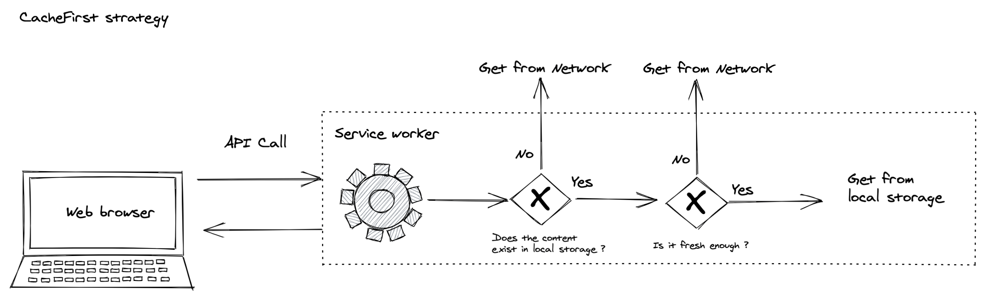

# Caching

- Date created: 2021-12-17

## Context

When new types of content are added (example: activities, type of places information, label, etc.), the related hiking pages then appear in error on the Geotrek-Rando website. This issue only exists in case of new content categories being added, not with every content update.
Simply restart the site to force the cache update or wait a few hours for the cache to reset.

It is also possible to completely disable Geotrek-Rando's cache but this may impact performance when loading pages. 

There are 2 caching strategies at work on this project.

## Service worker cache

The first one is the responsibility of the service worker. It handles the caching from the web browser of routes and urls that are called from the end user's machine. This is the mechanism allowing the site to be reached offline.

The configuration of this cache is handled in the `frontend/cache.js` file and in the `frontend/src/worker/index.js` file.
We use three different strategies here:

### Network First

This is the main strategy involved with offline support. We use it for the regular pages, API calls. These contents are always queried from the network unless it is unavailable.

They are stored in separated categories, each page has its own category (search, content, images, ...) and can cache up to 32 occurence each. The API calls are stored in the "other" category which can host up to 256 entries, when this category reaches 256 entries, the first ones will be poped out of the cache to keep storing the new content.

The map tiles is cached by the plugin [leaflet.offline](https://github.com/allartk/leaflet.offline) in an indexed database. Each content store tiles with the id of the content to keep a link and remove the tiles later.

Content page is cached in the Cache Storage in the "trek-pages" category. In addition, there is a resume in the local storage to fill the /offline page.

When constantly unable to reach the network, these resources will appear as "stale" after 90 days.

### Stale While Revalidate

We use this strategy for static assets offered by our website that can eventually change but don't need to be always fresh.

They will appear as "stale" after a day.

### Cache First

We use this strategy for fonts provided by third parties like google that are extremely unlikely to change.

They will appear as "stale" after a year.

## Nodejs Application cache

The second one consist in storing the configuration data (activities list, theme list etc..) we get from Geotrek-admin into ephemeral variable to avoid a lot of API calls to get the same data.

This configuration will appear as "stale" after one day.

If you need to make it available immediately, you can restart your container which will clear the memory and force the refreshment of this configuration data.

This cache can be disabled with ``enableServerCache`` setting in ``global.json`` (default to ``True``).

